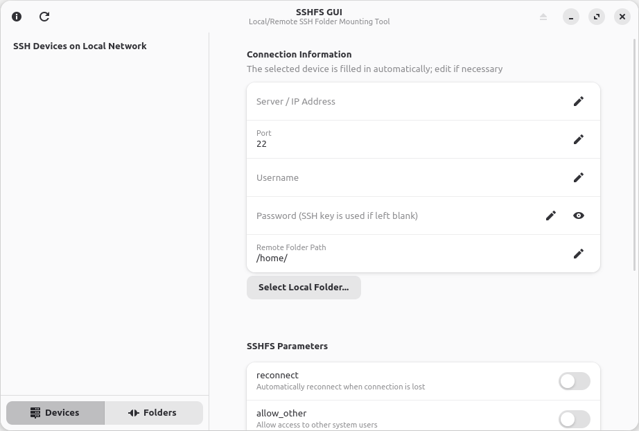
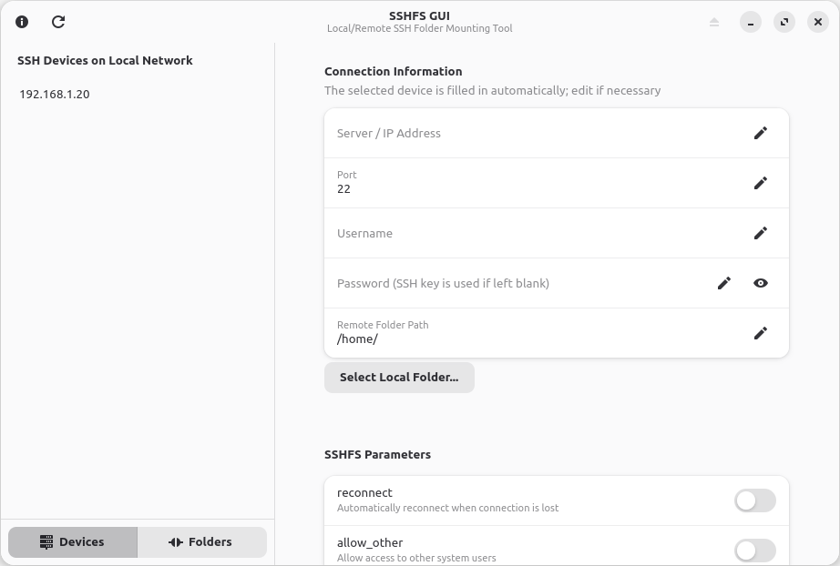
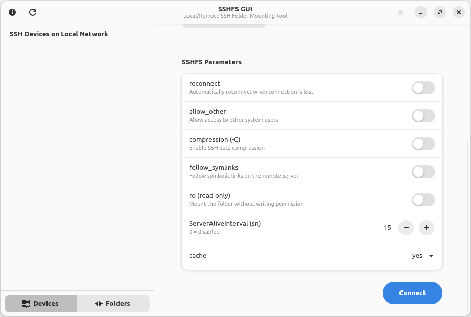
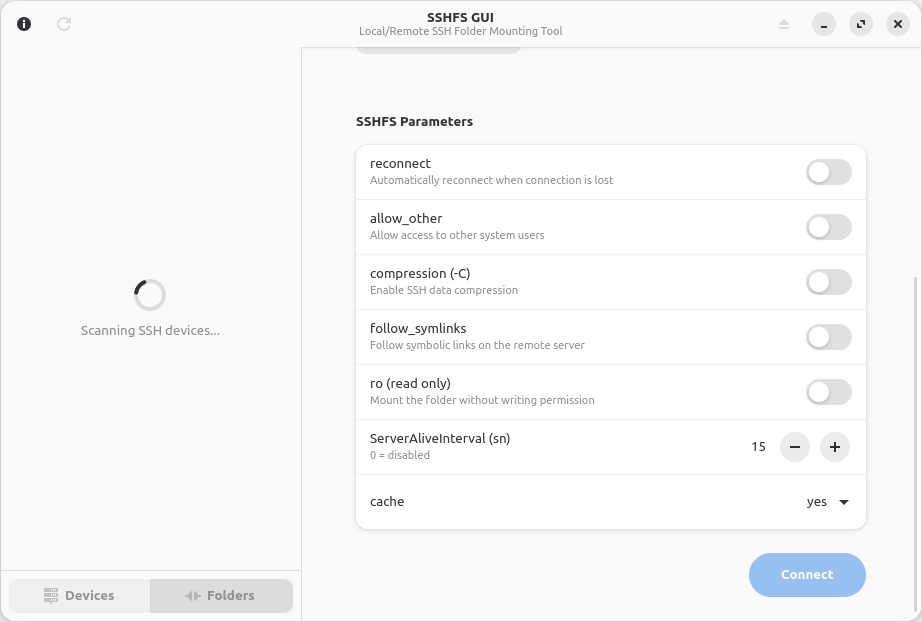
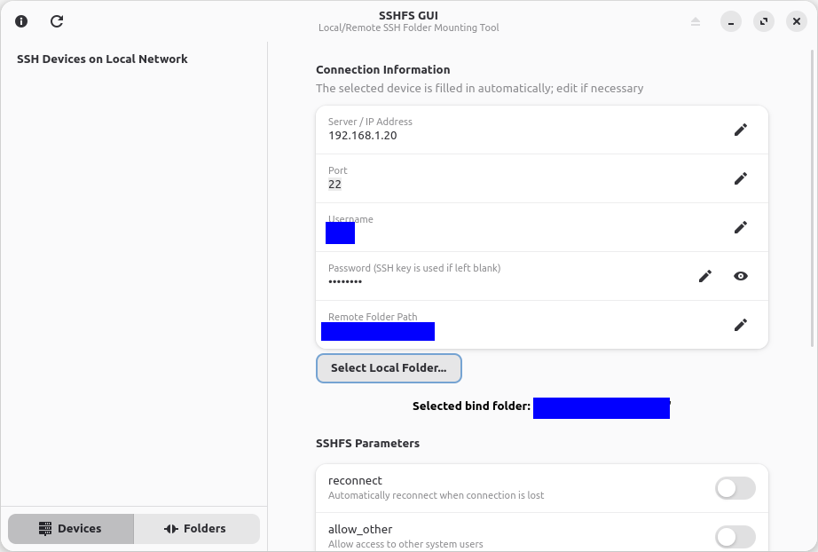
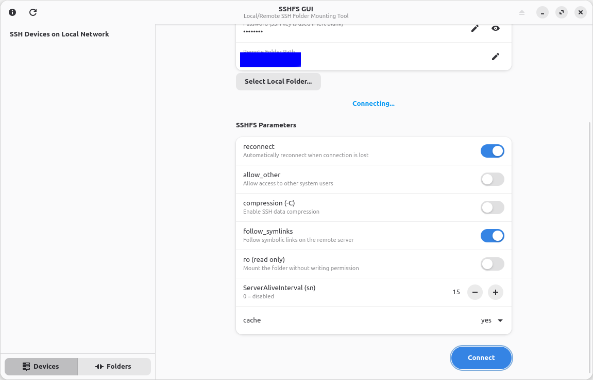
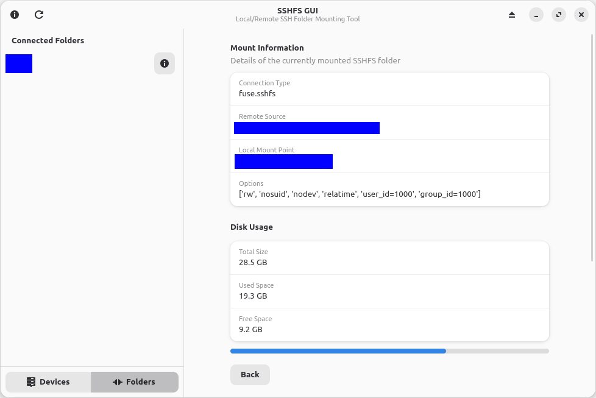

# SSHFS GUI
**A modern GTK4 and libadwaita graphical interface for SSHFS on Linux.**

SSHFS GUI makes it easy to mount and manage remote directories over SSH through a modern, user-friendly desktop interface. Instead of manually running terminal commands, users can configure connections, choose mount options, and access remote directories as part of their local filesystem.

## Overview

SSHFS GUI is a graphical frontend for [`sshfs`](https://github.com/libfuse/sshfs), allowing users to mount remote directories on their local Linux system without having to construct SSHFS commands manually.

Unlike traditional SFTP clients, SSHFS does not require applications to implement a remote file access protocol. Once a remote directory is mounted, it becomes accessible through a local mount point and can be used by file managers, terminals, scripts, and applications just like other filesystem paths.

SSHFS GUI brings this functionality to the desktop with a modern interface built using **GTK4** and **libadwaita**.

## Why SSHFS?

SSHFS uses FUSE to expose remote directories through the local filesystem. This makes it particularly useful for accessing files on NAS devices, home servers, development machines, and other systems available over SSH.

### Access remote files as local files

Once mounted, a remote directory becomes accessible through a local path, such as:

```text
/home/user/NAS
```

Applications can interact with files at this location using standard filesystem operations.

For example, a Python application can read a remote file without implementing SSH or SFTP support:

```python
with open("/home/user/NAS/data.txt", "r") as file:
    data = file.read()
```

This approach also works with other programming languages, command-line utilities, scripts, and applications that operate on filesystem paths.

### Works with existing applications

Because SSHFS exposes remote files through a local mount point, there is no need to develop application-specific integrations for every tool that needs access to remote data.

Mounted directories can be used with:

- File managers such as GNOME Files.
- Text editors and integrated development environments.
- Python scripts and other applications.
- Command-line tools and shell scripts.
- Data processing and machine learning workflows.
- Backup utilities and other filesystem-based tools.

### SSH-based access

SSHFS uses SSH for remote access, benefiting from SSH authentication and encrypted communication. It is particularly convenient for systems that already support SSH, including Linux servers and many NAS devices.

## Features

- **Graphical remote mounting:** Mount remote directories without manually entering SSHFS commands.
- **Mount options:** Configure supported SSHFS options through the graphical interface.
- **Local filesystem integration:** Access mounted directories through ordinary local filesystem paths.
- **SSHFS compatibility:** Uses the existing SSHFS command-line utility rather than implementing a separate remote filesystem protocol.
- **Modern Linux desktop interface:** Built with GTK4 and libadwaita for a native GNOME-style experience.

## Example Use Case

Suppose you have a NAS on your local network with the following directory:

```text
Remote host:    192.168.1.50
Remote path:    /volume1/Documents
Local mount:    /home/user/NAS
```

Using SSHFS GUI, you configure the connection and mount the directory.

The remote files then become accessible at:

```text
/home/user/NAS
```

You can browse them using your file manager, open documents in your preferred editor, or process them using your own scripts and applications.

When you no longer need the connection, you can unmount the directory through the graphical interface.

## Limitations

SSHFS provides filesystem access over a network connection, so performance and availability depend on network conditions and the remote server.

It is not equivalent to a local disk. Operations involving many small files or frequent random access may be slower than on local storage. Network interruptions can also affect access to mounted directories.

SSHFS GUI does not replace SSHFS; it makes its functionality more accessible through a graphical interface.

## Technology Stack

- **Python**
- **GTK4**
- **libadwaita**
- **SSHFS**
- **FUSE**

## Screenshots









